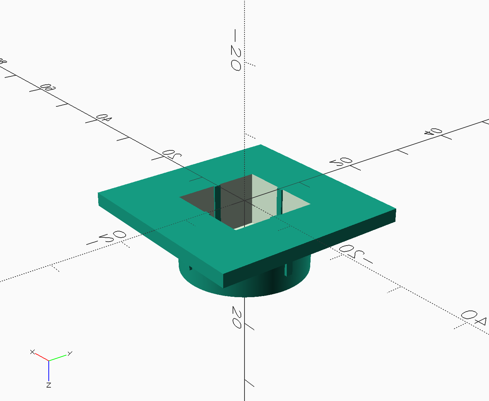
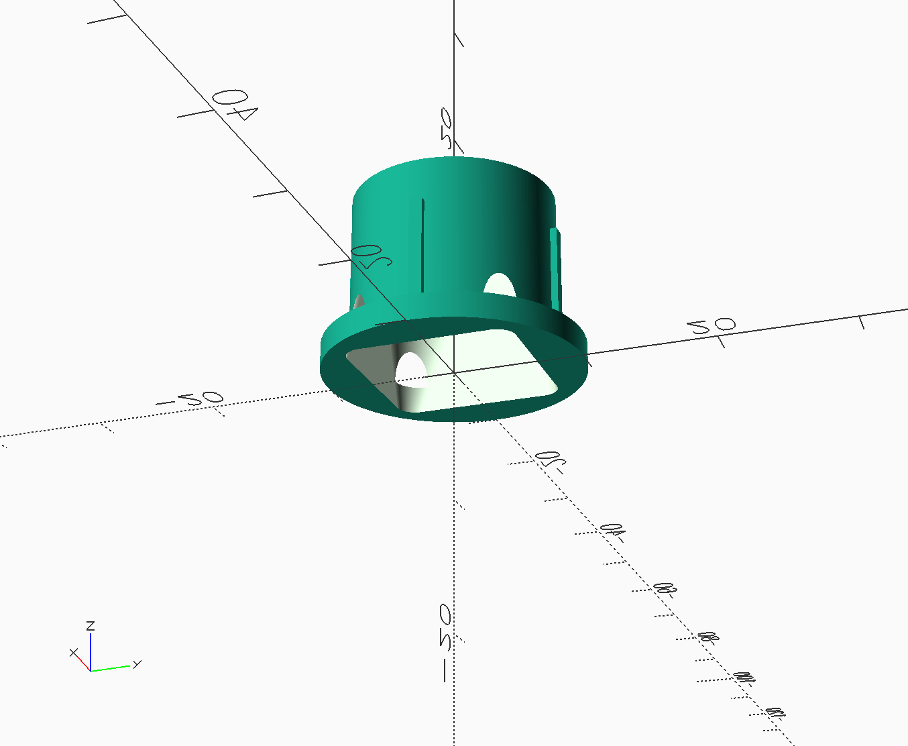
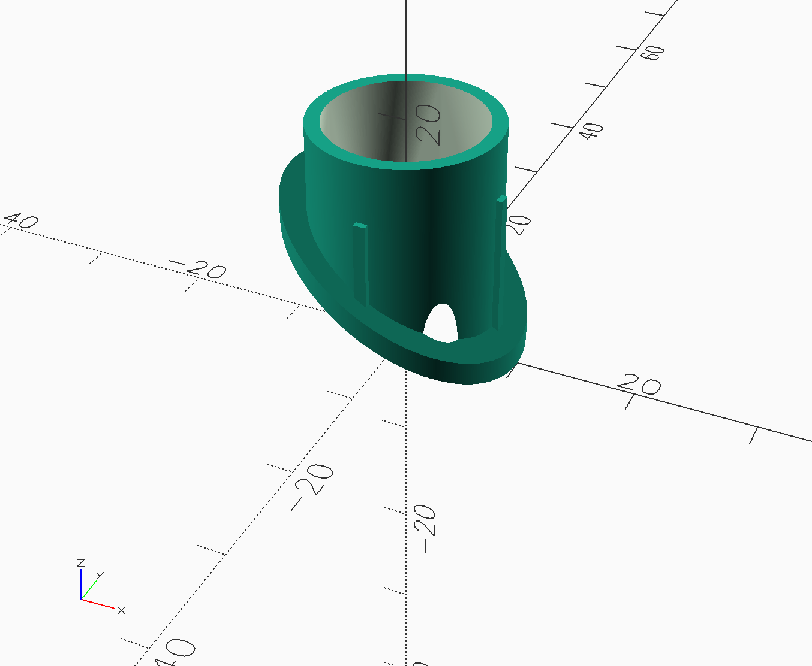
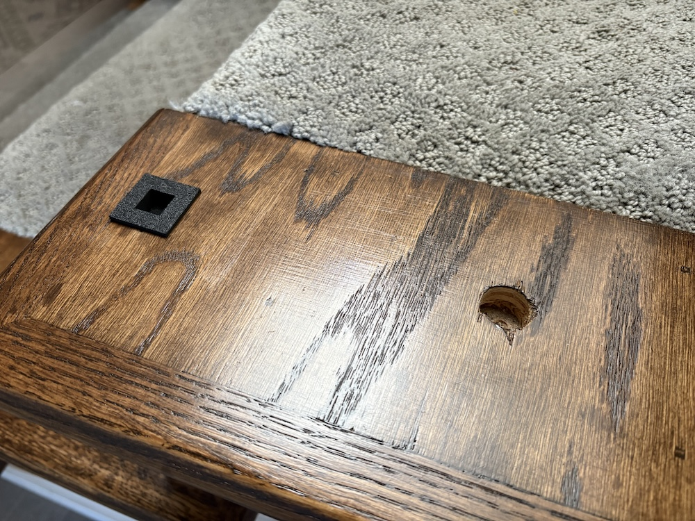
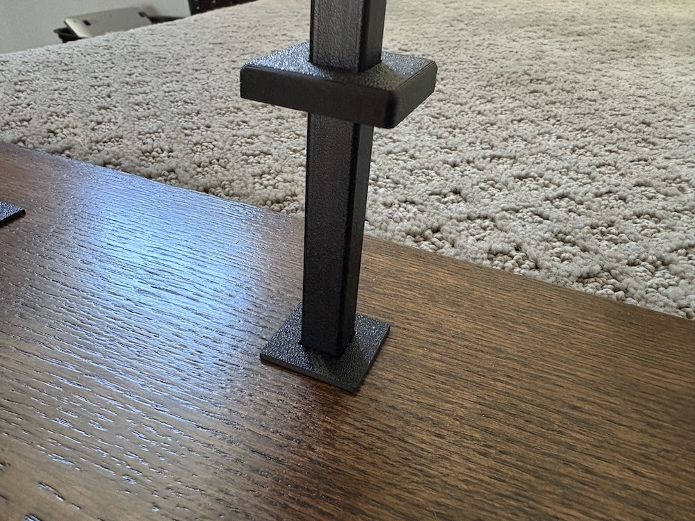
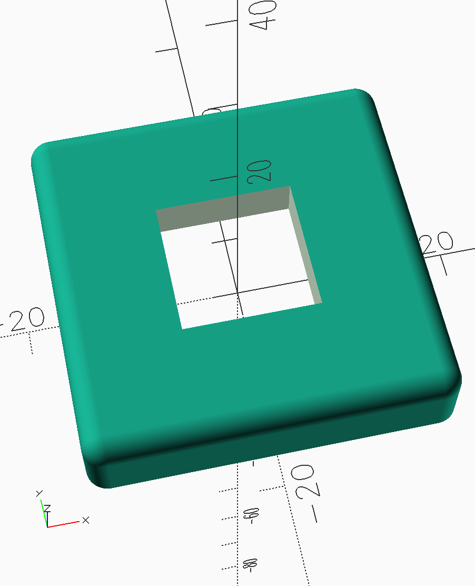
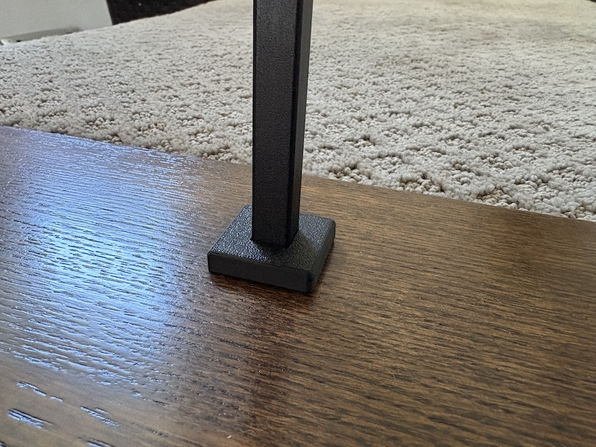
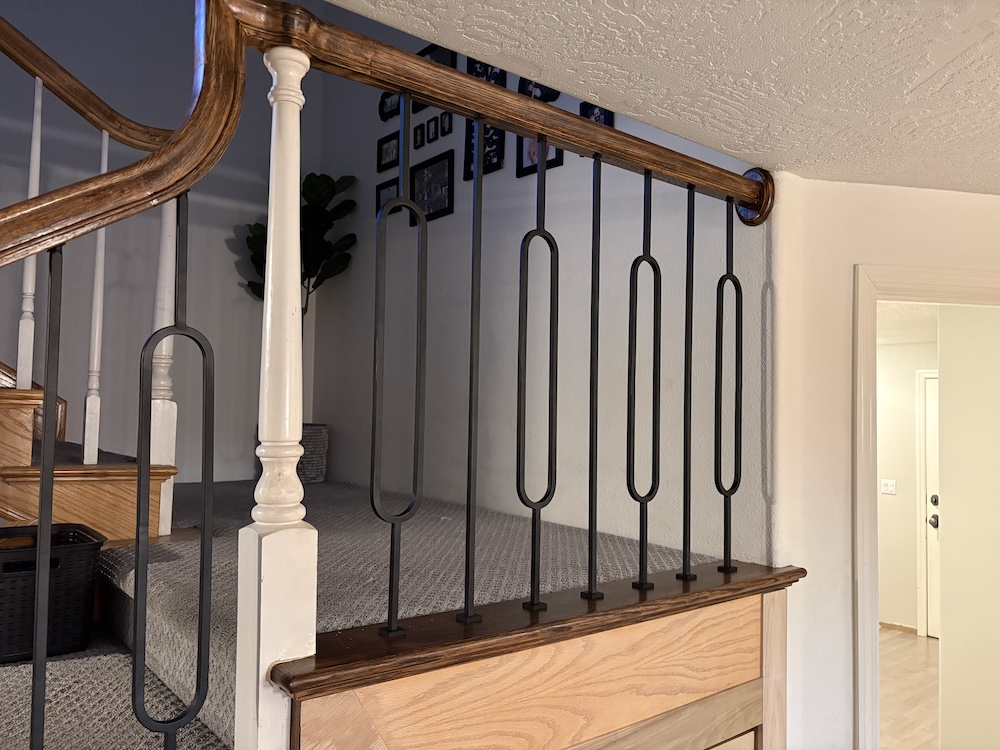

3D-Printed Baluster Hardware
============================

These models are for assisting in the installation of new stairway balusters in an existing stairway.

My old balusters had 3/4" dowel tenons into the bottom stair treads and extended into 3/8" holes in the underside of the handrail.

My new balusters were 1/2" square on the bottom and 1/2" round on the top (transitioning into a 1/2" square). Specifically, they are a mix of these two balusters from Home Depot:

https://www.homedepot.com/p/EVERMARK-Stair-Parts-44-in-x-1-2-in-Matte-Black-Plain-Iron-Baluster-for-Stair-Remodel-I555B-044-HD00D/202088527

https://www.homedepot.com/p/EVERMARK-Stair-Parts-44-in-x-1-2-in-x-3-3-4-in-Matte-Black-Oval-Iron-Baluster-for-Stair-Remodel-I564B-044-HD00D/316139815

In order to fit the square pegs in the round holes, I modeled a socket for each end that would accept the end of the baluster and friction fit into the old hole.

On the non-landing portion of the stairs, the top socket had an integrated angle:

I added friction ridges in each one to keep the balusters from rotating.

Finally, I modeled a shoe for the baluster to cover the bottom socket.

(The top socket is unobtrusive and didn't need covering.) The shoe is modeled in the style of this commercially available shoe:

https://www.jmpwood.com/products/baluster-shoe-9054bs-square-1-2-square-base-shoe

To install the balusters, you fit the bottom socket into place, slide the shoe onto the bottom of the baluster, and place the top socket on top of the baluster. Angle the baluster, and insert the top into the underside of the railing. Continue pushing up while you position the bottom of the baluster over the bottom socket, and then push the bottom of the baluster down into the socket. Once it's seated, slide the top socket up into the hole, securing everything in place. For this to work, each baluster should be cut to 5/8" longer than the opening between the bottom stair tread and the underside of the railing. For balusters on the angled portion of the stairs, this should be 5/8" longer than the longest side of the baluster that will be exposed.

Now, the new balusters are completely installed without any modification to the stairway, and they're completely removable without any tools. The best of both worlds!